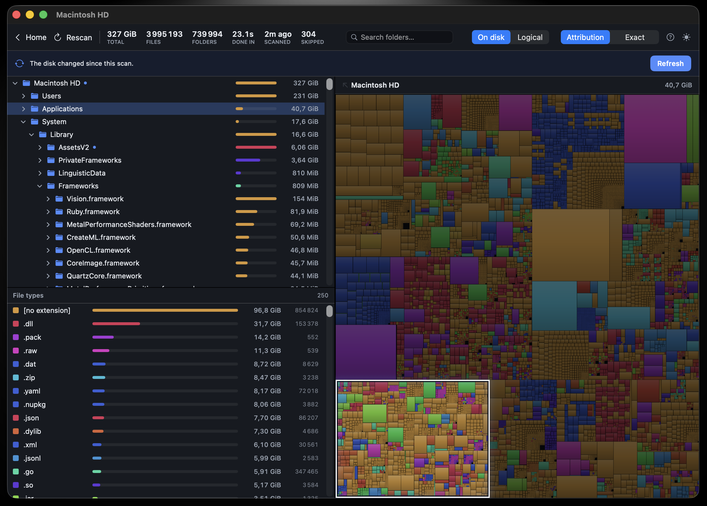
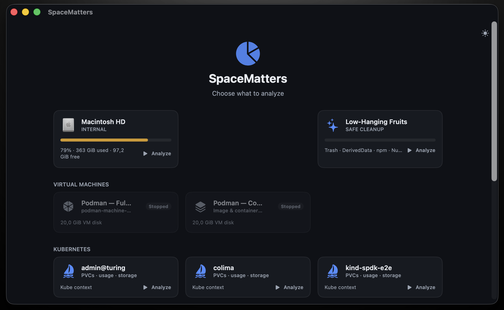
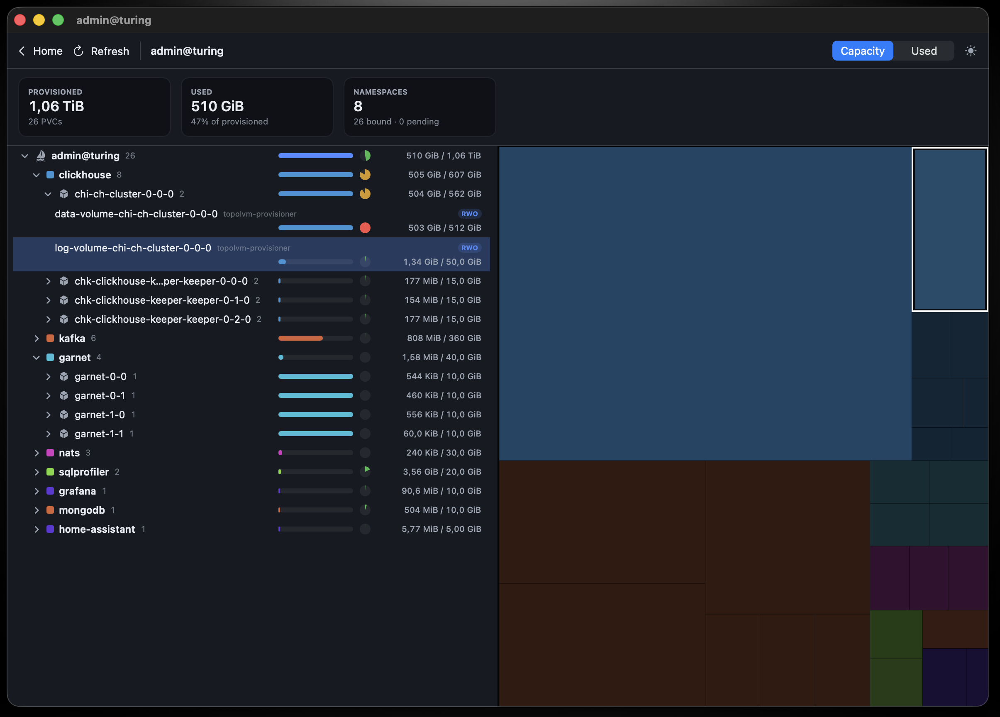

# SpaceMatters

A space usage visualizer for Disks, VMs, Kubernetes and even ssh. It scans fast, shows results while it scans, and keeps memory use low.

 

## What it does

Pick a disk, a cluster, a VM, and SpaceMatters maps everything inside it as a squarified treemap, next to a sortable directory outline and a breakdown by file type. The view fills in live during the scan instead of appearing at the end. Toggle between on-disk and logical sizes, and rescan just what changed when the disk moves under you.

## Beyond the local disk

The home screen lists everything worth analyzing, not just volumes.

- **Low-Hanging Fruits** — a safe one-click cleanup pass over the usual suspects: Trash, `DerivedData`, npm and NuGet caches, and friends. It only ever touches locations that are safe to regenerate.
- **Virtual machines** — Podman machines, scanned from inside the VM.
- **Kubernetes** — pick a kube context and see every PVC by namespace, provisioned capacity against actual usage, as the same treemap.

## How it stays fast and lean

The scanner relies on [`getattrlistbulk(2)`](Sources/SpaceMatters/Scanner/FSAttr.swift), a syscall that returns many directory entries with their sizes in one call, so there is no `readdir` plus `stat` for every file. A pool of worker threads walks subtrees in parallel.

Memory stays low because the tree keeps one [`FSNode`](Sources/SpaceMatters/Model/FSNode.swift) per directory only. Files collapse into aggregates inside their parent folder, and [`ExtKey`](Sources/SpaceMatters/Model/ExtKey.swift) packs each extension into two integers, so no `String` is allocated per file.

Sizes are atomic counters propagated up the ancestor chain as each directory completes, and the UI reads them ten times per second. That is what makes the live view possible.

## Download

Grab the latest signed and notarized `.dmg` from the [Releases page](../../releases/latest), open it, and drag SpaceMatters into Applications. It launches without a Gatekeeper warning.

## Good to know

- This project is vibe-coded.
- Feedbacks are welcome ;)
- The physical total matches `du -skx` in testing. The scan stays on the volume you picked and does not cross into mounted filesystems (swap, Preboot, external disks, DMGs), like `du -x`.
- Symlinks are counted by their own size and never followed, so no cycles.
- Files with hard links are counted once per link, as WinDirStat does.
- Scanning system locations may require granting access. Entries that cannot be read are skipped and reported as a skipped count.
- The treemap works at directory granularity, files aggregate into their folder. This is a deliberate memory tradeoff, and finer per file detail may come later.

## Requirements

macOS 15 or later, with a Swift 6 toolchain (Xcode 16 or later).
