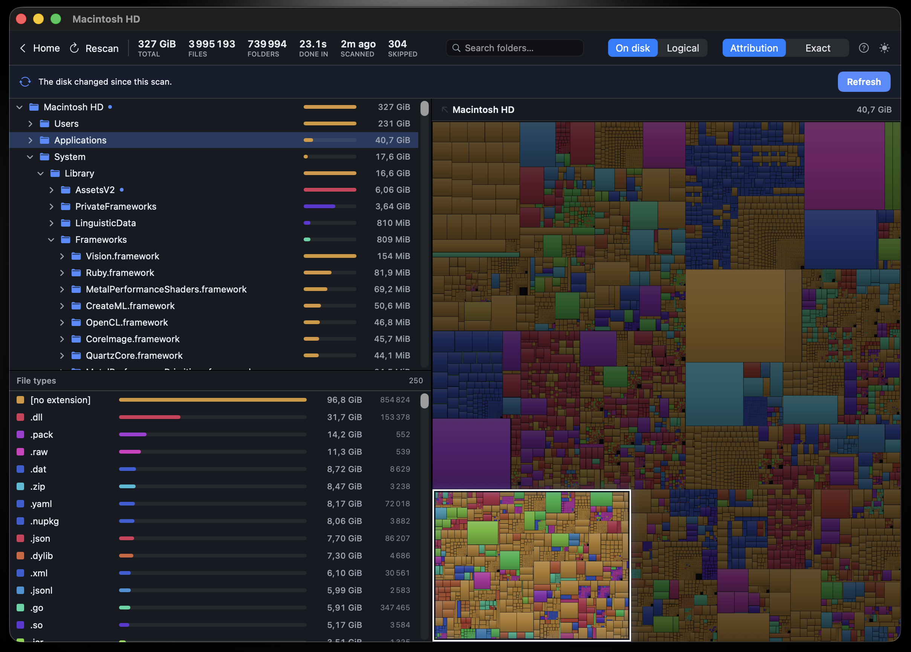
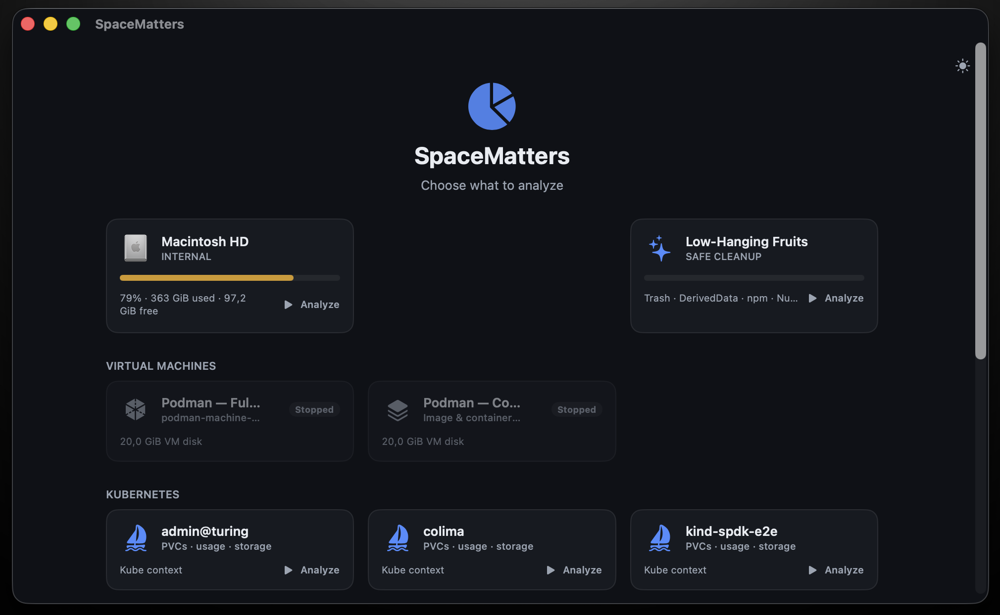
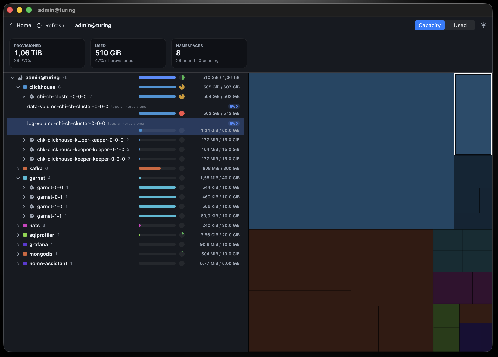

# SpaceMatters

A space usage visualizer for Disks, VMs, Kubernetes and even ssh. It scans fast, shows results while it scans, and keeps memory use low.

 



## What it does

Pick a disk, a cluster, a VM, and SpaceMatters maps everything inside it as a squarified treemap, next to a sortable directory outline and a breakdown by file type. The view fills in live during the scan instead of appearing at the end. Toggle between on-disk and logical sizes, and rescan just what changed when the disk moves under you.

## Beyond the local disk

The home screen lists everything worth analyzing, not just volumes.



- **Low-Hanging Fruits** — a safe one-click cleanup pass over the usual suspects: Trash, `DerivedData`, npm and NuGet caches, and friends. It only ever touches locations that are safe to regenerate.
- **Virtual machines** — Podman machines, scanned from inside the VM.
- **Kubernetes** — pick a kube context and see every PVC by namespace, provisioned capacity against actual usage, as the same treemap.



## How it stays fast and lean

The scanner relies on [`getattrlistbulk(2)`](Sources/SpaceMatters/Scanner/FSAttr.swift), a syscall that returns many directory entries with their sizes in one call, so there is no `readdir` plus `stat` for every file. A pool of worker threads walks subtrees in parallel.

Memory stays low because the tree keeps one [`FSNode`](Sources/SpaceMatters/Model/FSNode.swift) per directory only. Files collapse into aggregates inside their parent folder, and [`ExtKey`](Sources/SpaceMatters/Model/ExtKey.swift) packs each extension into two integers, so no `String` is allocated per file.

Sizes are atomic counters propagated up the ancestor chain as each directory completes, and the UI reads them ten times per second. That is what makes the live view possible.

## Asking an LLM about your disk

Two ways, both local — nothing is uploaded, and SpaceMatters still makes no network request beyond its update feed.

**Copy a briefing.** `⌘⇧C` puts a compact digest of the current view on the clipboard: totals, file types, and a tree budgeted to a few thousand tokens. Detail follows size rather than depth, single-child chains collapse, small siblings roll up, and folders carry what a size alone can't say — `cold:8mo` when nothing inside has been written since, `sparse`, or `cache:npm` when it's a location the app can safely empty itself. Paste it into any assistant.

**Or let a Claude session query the scan directly**, through a read-only MCP server:

```sh
claude mcp add spacematters -- /Applications/SpaceMatters.app/Contents/MacOS/SpaceMatters --mcp
```

The session gets `overview`, `tree`, `top`, `types`, `find`, `aged`, `explain` and `cleanup_targets`. `find` is the one with no cheap shell equivalent — "19 `node_modules`, 6.7 GiB between them" is a single walk over the scan and a `find | xargs du` storm otherwise. `aged` answers the other half of any delete decision: regenerable *and* untouched for a year.

**If SpaceMatters is open, the session attaches to it** — no second scan, and it sees exactly the tree on your screen. Two more tools appear: `focus` moves the app to the folder being discussed, and `annotate` paints a verdict onto the treemap and the sunburst. Mark a folder `safe`, `review` or `keep` and its whole region takes that colour, with the reason on hover — a colour alone is never the argument, so the sentence behind it is required. Edit › Clear LLM Verdicts undoes the lot. Close the app and the same command falls back to scanning on its own.

The server scans once on the first call (`$HOME` by default, or pass a path) and answers from memory after that. **It cannot delete anything** — no such tool exists. Its output is a plan; the cleanup pass in the app is what acts on it, fenced and journalled. Anything it could not read, it says so rather than quietly under-reporting.

## Download

Grab the latest `.dmg` from the [Releases page](../../releases/latest), open it, and drag SpaceMatters into Applications.

The app isn't notarized (that needs a paid Apple Developer account), so Gatekeeper blocks it on first launch. Clear the quarantine flag once and it opens normally from then on:

```sh
xattr -d com.apple.quarantine /Applications/SpaceMatters.app
```

## Updates

SpaceMatters updates itself in place via [Sparkle](https://sparkle-project.org) — that first-launch dance never comes back: updates are verified by a signature pinned inside the app and released from quarantine by the updater, and the Full Disk Access grant survives them.

Nothing runs before you opt in. On the second launch the app asks whether it may check for updates automatically; decline and it never checks on its own. "Check for Updates…" in the app menu works on demand either way. The only network request the app ever makes is fetching the update feed and archive from this repository's Releases — no telemetry, nothing is sent.

## Good to know

- This project is vibe-coded.
- Feedbacks are welcome ;)
- The physical total matches `du -skx` in testing. The scan stays on the volume you picked and does not cross into mounted filesystems (swap, Preboot, external disks, DMGs), like `du -x`.
- Symlinks are counted by their own size and never followed, so no cycles.
- Files with hard links are counted once per link, as WinDirStat does.
- Scanning system locations may require granting access. Entries that cannot be read are skipped and reported as a skipped count.
- The treemap works at directory granularity, files aggregate into their folder. This is a deliberate memory tradeoff, and finer per file detail may come later.

## Requirements

macOS 15 or later, with a Swift 6 toolchain (Xcode 16 or later).
